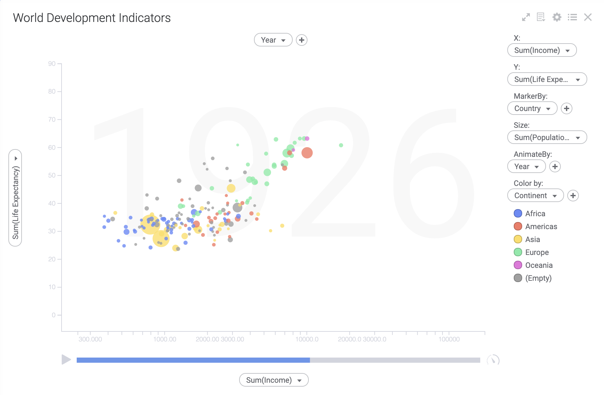

# Animated Bubble Chart Mod for TIBCO Spotfire®
The animated bubble chart can be used to show how 2-4 measures changes over time. This method of visualizing changes over time was popularized by Hans Rosling in [a famous TED talk from 2006](https://www.ted.com/talks/hans_rosling_the_best_stats_you_ve_ever_seen) where he used it to show changes in global health and economics. Here's what that dataset looks like in Spotfire using the animated bubble chart mod.

Clicking on the play button in the lower left hand corner below the visualization will show how Life Expectancy and Income per capita in different countries have changed over time.

## Try this mod in Spotfire Analyst

### How to open the mod
1. Open Spotfire Analyst, and create an analysis by loading some data.
2. Unzip the downloaded file, and locate the .mod file in the unzipped folder.
3. Drag the file into the analysis.
4. The visualization mod is added to the analysis.
5. To learn about the capabilities and limitations of this visualization mod, keep reading.

For general information on how to use and share visualization mods, [read the Spotfire documentation](https://docs.tibco.com/pub/sfire-analyst/11.0.0/doc/html/en-US/TIB_sfire-analyst_UsersGuide/index.htm?_ga=2.41319073.2072719993.1606728875-1950738096.1600074380#t=modvis%2Fmodvis_how_to_use_a_visualization_mod.htm).

## Data requirement
The animated bubble chart can be used to visualize and animate any multi-variate dataset that contains snapshots of values taken at different timepoints. In order to make it work properly a data table with at least four columns is required: 

- One column should identify the bubbles, for example, names of countries, people or objects.
- One column shoud contain a time point, for example years, or weeks.
- Two columns should contain measures for the country, person or object taken at different times.

Note that every mod handles missing, corrupted and/or inconsistent data in different ways. It is advised to always review how the data is visualized before relying on it to make important decisions.

## Setting up the animated bubble chart
Let's say we have a grocery sales dataset that contains data about prices, costs and sales volume for different items: 

Type   | Item     | Year | Price | Cost | Sales
-------|----------|------|-------|------|------------
Fruit  |Apple     | 2000 | 5     | 3    | 10
Fruit  |Apple     | 2001 | 6     | 12   | 8
Fruit  |Apple     | 2002 | 7     | 13   | 9
Fruit  |Apple     | 2003 | 10    | 5    | 11
Fruit  |Banana    | 2000 | 7     | 1    | 16
Fruit  |Banana    | 2001 | 9     | 5    | 20
Fruit  |Banana    | 2002 | 10    | 8    | 25
Fruit  |Banana    | 2003 | 11    | 9    | 10
Fruit  |Pear      | 2000 | 4     | 1    | 8
Fruit  |Pear      | 2001 | 5     | 5    | 5
Fruit  |Pear      | 2002 | 3     | 8    | 15
Fruit  |Pear      | 2003 | 2     | 20   | 25
Veg.   |Cucumber  | 2000 | 1     | 4    | 10
Veg.   |Cucumber  | 2001 | 9     | 2    | 8
Veg    |Cucumber  | 2002 | 10    | 13   | 9
Veg.   |Cucumber  | 2003 | 5     | 5    | 11
Veg.   |Squash    | 2000 | 3     | 8    | 16
Veg.   |Squash    | 2001 | 2     | 2    | 20
Veg.   |Squash    | 2002 | 3     | 2    | 25
Veg.   |Squash    | 2003 | 10    | 8    | 10

A basic animated bubble chart can be configured to show how prices and costs for different items have varied over time by creating an animated bubble chart with the following settings:

- Y = Avg(Price)
- X = Avg(Cost)
- Animate By = Year
- Marker By = Item

Optionally you could also use color and size to show additional dimensions. E.g:

- Color By = Type
- Size By = Sales

The end results will look something like this: 

The chart above shows one bubble for each item in your inventory list. Each bubble is positioned according to the price and cost in the year 2000. The size of the bubble represent the sales volume that year and the bubble is colored by item type. The current year is shown behind the visualization.

When you click the the play button in the lower left hand corner the chart will cycle through the dataset and display data for each year. You can click pause to stop the animation at any time. 

### Scrubbing

Click anywhere in the animation slider to skip to a particular time point. Drag the handle to manually move back and forth in time. 

### Animation speed

Click the speedometer to the right of the animation slider change the speed of the animation. 

### Marking

Clicking on a bubble will mark it in all timepoints. This makes it easy to follow one or more bubbles throughout the animation. Clicking in the empty space in between bubbles will clear the marking. You can mark several bubbles by Ctrl-clicking on them. Clicking and dragging allow you to select multiple bubbles. You can select all bubbles within a range of values by dragging along the y- or x-axis. 

### Labels

By default marked bubbles will be labeled. You can turn this behavior on or off by right-clicking in the y-axis area and checking or unchecking show labels for marked rows.

### Log scales

Natural dataset often contains a lot of small values and a few larger values. If this is the case with data that you want to aninmate you may end up with a visualization that shows a lot of overlapping bubbles in the lower left hand corner of the visualization. One way to handle that is to use a log-scale on the x- or y-axis. You can turn on and off log-scales by right clicking in the x- or y-axis area and checking or unchecking the log-scale checkbox.

## Building the mod

### Source code

The source code for the animated bubble chart mod can be found here: https://github.com/TIBCOSoftware/spotfire-mods/tree/master/catalog/animated-bubble-chart

### Developing the mod

Build Project

In a terminal window:

- `npm install`
- `npm run build-watch`

In a new terminal window

- `npm run server`

### Build for production

The development version of bundle.js is uncompressed and not suitable for end users. Run the following command to compress the bundle.
- `npm run build`

## More information about TIBCO Spotfire® Mods

- [Spotfire® Mods on the TIBCO Community Exchange](https://community.tibco.com/exchange): A safe and trusted place to discover ready-to-use mods
- [Spotfire® Mods Developer Documentation](https://tibcosoftware.github.io/spotfire-mods/docs/): Introduction and tutorials for mods developers
- [Spotfire® Mods by TIBCO Spotfire®](https://github.com/TIBCOSoftware/spotfire-mods/releases/latest): A public repository for example projects

## Version history

### 1.1

- Removed hard limit of 100,000 rows and changed to limiting the number of displayed bubbles to 100,000
- Increased robustness for edge cases such as invalid axis expressions, empty data views etc.

### 1.0

- First version
