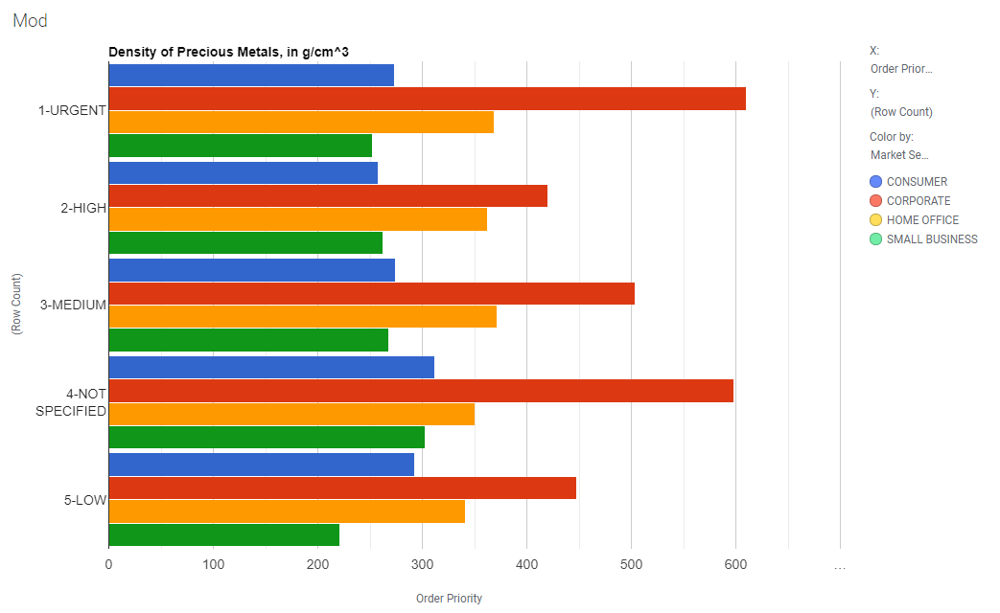
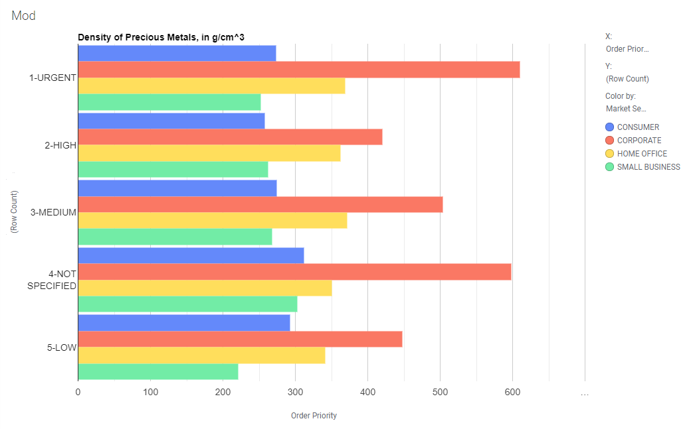
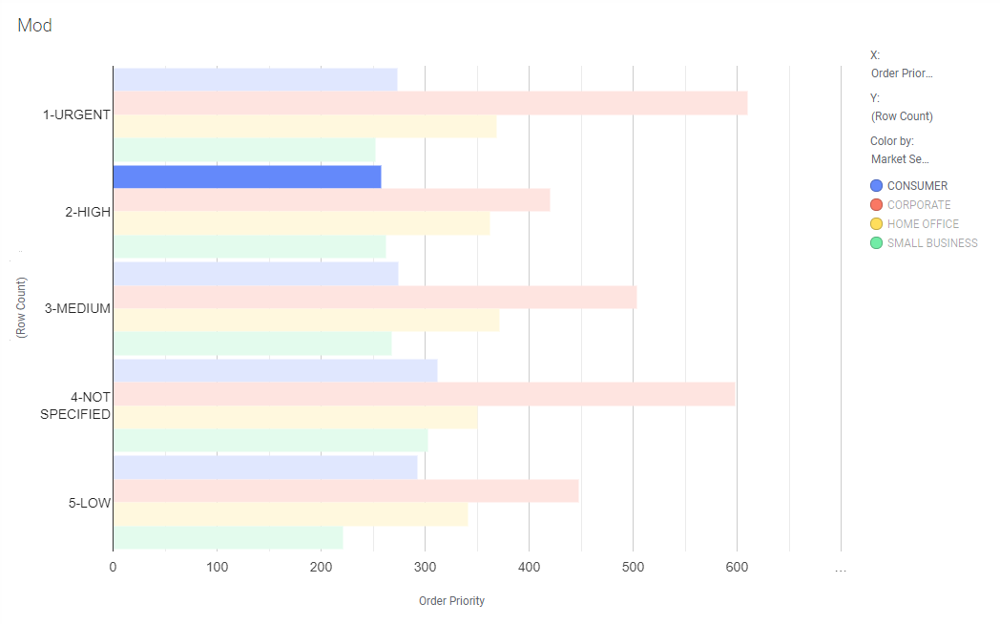

## A step-by-step Tutorial on using Spotfire Mods

We will be using **Spotfire API** and **googlecharts** to create a basic bar chart.

This tutorial will cover the following:

- Initial setup
- Consuming and visualizing data
- Selection / marking
- Theme-ing
- Controlling the mod using popout menu
- Export to PDF


**Full code of this tutorial project (`'js-dev-barchart-googlecharts'`) as well as the starter project (`'js-dev-starter'`) can be found in the SDK zip.** 

The full version of the example (found in SDK) covers some extra cases that are outside of the scope of this tutorial.


## Prerequisites

- A running instance of _Spotfire_
- A code editor. It is highly recommended to use Visual Studio Code when developing a mod. The mod example include predefined settings for VS Code that enable a default build task, intellisense in the mod manifest and intellisense in the JavaScript code.
- `node.js` installed

---

### 1. Initial setup

- Copy `js-dev-starter` project and rename to something relevant, like `my-barchart-mod`. The starter project has a minimum amount of code for a working mod.
- Open the folder in a terminal or command line.
- Run `npm install` to install dependencies.
- Run `npm run server` to start the server. The provided server setup allows us to see live updates when developing a mod.
- In **Spotfire** go to _Tools > @Create Visialization Mod_ and **connect to the project** by following the on-screen steps (_Connect to Project > Development server > Connect_)
- You should see some mod metadata on the screen, which means the mod is working.


---

### 2. Add google charts library

- We will be using [this](https://developers.google.com/chart/interactive/docs/gallery/barchart) google example
- Add google chart loader script to _index.html_

```diff
     <body>
         <div id="mod-container"></div>
         <script id="spotfire-loader">var Spotfire=function(e){"use strict";return e.initialize=function(e){var t="sfTemp"+1e4*Math.random()+"Cb",a=window;a[t]=e;var r={subject:"GetUrl",callbackId:-1,...</script>
+        <script type="text/javascript" src="https://www.gstatic.com/charts/loader.js"></script>
         <script src="main.js"></script>
     </body>
 </html>
```

- Paste full example code into _main.js_ inside **render** function


```diff
     async function render(dataView, windowSize, prop) {

         /**
          * Get rows from dataView
          */
         const rows = await dataView.getAllRows();

-        /**
-         * Print out to document
-         */
-        const container = document.querySelector("#mod-container");
-        container.innerHTML += `windowSize: ${windowSize.width}x${windowSize.height}<br/>`;
-        container.innerHTML += `should render: ${rows.length} rows<br/>`;
-        container.innerHTML += `${prop.name}: ${prop.value}`;
+        google.charts.load("current", { packages: ["corechart"] });
+        google.charts.setOnLoadCallback(drawChart);
+        function drawChart() {
+            var data = google.visualization.arrayToDataTable([
+                ["Element", "Density", { role: "style" }],
+                ["Copper", 8.94, "#b87333"],
+                ["Silver", 10.49, "silver"],
+                ["Gold", 19.3, "gold"],
+                ["Platinum", 21.45, "color: #e5e4e2"]
+            ]);
+
+            var view = new google.visualization.DataView(data);
+            view.setColumns([0, 1, { calc: "stringify", sourceColumn: 1, type: "string", role: "annotation" }, 2]);
+
+            var options = {
+                title: "Density of Precious Metals, in g/cm^3",
+                width: 600,
+                height: 400,
+                bar: { groupWidth: "95%" },
+                legend: { position: "none" },
+            };
+            var chart = new google.visualization.BarChart(document.getElementById("barchart_values"));
+            chart.draw(view, options);
+        }
     }
 });
```

- Update the BarChart container id (in  _index.html_  our container id is _mod-container_)

```diff
     
            var options = {
               title: "Density of Precious Metals, in g/cm^3",
               width: 600,
               height: 400,
               bar: { groupWidth: "95%" },
               legend: { position: "none" },
           };
-            var chart = new google.visualization.BarChart(document.getElementById("barchart_values"));
+            var chart = new google.visualization.BarChart(document.getElementById("mod-container"));
            chart.draw(view, options);
```

- Save the changes. You should see the example working in Spotfire.


- Make use of _async / await_ to get rid of extra code. 
- Make the chart fit the screen by providing a chart area with some predefined margins.

```diff
-       google.charts.load("current", { packages: ["corechart"] });
-       google.charts.setOnLoadCallback(drawChart);
+       await google.charts.load("current", { packages: ["corechart"] });

-       function drawChart() {
          var data = google.visualization.arrayToDataTable([
              ["Element", "Density", { role: "style" }],
              ["Copper", 8.94, "#b87333"],
              ["Silver", 10.49, "silver"],
              ["Gold", 19.3, "gold"],
              ["Platinum", 21.45, "color: #e5e4e2"]
          ]);

          var view = new google.visualization.DataView(data);
          view.setColumns([0, 1, { calc: "stringify", sourceColumn: 1, type: "string", role: "annotation" }, 2]);

          var options = {
              title: "Density of Precious Metals, in g/cm^3",
-             width: 600,
-             height: 400,
              bar: { groupWidth: "95%" },
              legend: { position: "none" },
+             chartArea: { left: 85, top: 20, right: 10, bottom: 40 }
          };
          var chart = new google.visualization.BarChart(document.getElementById("mod-container"));
          chart.draw(view, options);
        }
-     }
```

---

### 3. Consume Spotfire data


- We create hierarchies for X and Color dimensions. These are defined in the manifest and should not be confused with actual color values (**css-color** from now on to avoid confusion).
- We then use this grouped data to extract column names, values and css-colors.
- A google visualization expects data to be in the following format (and complains if it's not):

SeriesNames|Series1|Series2|Series3
---|---|---|---
Category1|Value11|Value12|Value13
Category2|Value21|Value22|Value23

* We loop over X hierarchy to create the data table.

```diff
-        var data = google.visualization.arrayToDataTable([
-            ["Element", "Density", { role: "style" }],
-            ["Copper", 8.94, "#b87333"],
-            ["Silver", 10.49, "silver"],
-            ["Gold", 19.3, "gold"],
-            ["Platinum", 21.45, "color: #e5e4e2"]
-        ]);
        
+        const ALL_VALUES = "All Values";
+        const colorHierarchy = await dataView.getHierarchy("Color", true);
+        const colorLeafNodes = await colorHierarchy.leaves();
+        const colorDomain = colorHierarchy.isEmpty ? [ALL_VALUES] : colorLeafNodes.map(node => node.fullName());


-        var view = new google.visualization.DataView(data);
-        view.setColumns([0, 1, { calc: "stringify", sourceColumn: 1, type: "string", role: "annotation" }, 2]);
+        const xHierarchy = await dataView.getHierarchy("X", true);
+        const xLeafNodes = await xHierarchy.leaves();
+        const xDomain = xLeafNodes.map(node => node.fullName());

+        const dataColumns = ["Columns"];
+        colorDomain.forEach(value => dataColumns.push(value));

+         const dataRows = [];
+        xLeafNodes.forEach(
+            (node) => {
+                const name = node.fullName();
+                const rows = node.rows();
+                const dataRow = [name];
+                rows.forEach((v) => dataRow.push(v.get("Y").getValue()));
+                dataRows.push(dataRow);
+            }
+        );

+        var data = google.visualization.arrayToDataTable([dataColumns, ...dataRows]);

         var options = {
             title: "Density of Precious Metals, in g/cm^3",
             bar: { groupWidth: "95%" },
             legend: { position: "none" },
             chartArea: { left: 85, top: 20, right: 10, bottom: 40 }
         };
         var chart = new google.visualization.BarChart(document.getElementById("mod-container"));
-        chart.draw(view, options);
+        chart.draw(data, options);
```



- Not all combinations of _X_ and _Color_ domains will be renderable by google charts out of the box, without special treament. We will guard against this with a **try / catch** block.
- The full code of the example (found in SDK) goes a little bit more in depth and covers some extra cases.

```diff
-        const data = google.visualization.arrayToDataTable([dataColumns, ...dataRows]);
+        let data;
+        try {
+            data = google.visualization.arrayToDataTable([dataColumns, ...dataRows]);
+        } catch (e) {
+            console.log(e);
+        }
```

- Lastly, to apply colors to each individual bar we need to add a styling column after each value.

SeriesNames|Series1|Style|Series2|Style|Series3|Style
---|---|---|---|---|---|---
Category1|Value11|CssColor11|Value12|CssColor12|Value13|CssColor13
Category2|Value21|CssColor21|Value22|CssColor22|Value23|CssColor23

```diff
         const xHierarchy = await dataView.createHierarchy(rows, "X");
         const xDomain = xHierarchy.children.map(node => node.name);

-        const dataColumns = ["Columns"];
-        colorDomain.forEach(value => dataColumns.push(value));
+        const dataColumns = ["Colors"];
+        colorDomain.forEach(value => dataColumns.push(value, { role: "style" }));

         const dataRows = [];
         xLeafNodes.forEach(
             (node) => {
                const name = node.fullName();
                const rows = node.rows();
                const dataRow = [name];
-               rows.forEach((v) => dataRow.push(v.get("Y").getValue()));
+               rows.forEach((v) => dataRow.push(v.get("Y").getValue(), v.getColor().hexCode));
             dataRows.push(dataRow);
         });
```



---

### 4. Marking / Selection

- Add marking/selection logic. We listen for "select" event and extract X and Color values (_not css-color!_) by index in their respective domains. The Color index is halved because we have 2 times as many columns due to styling being applied (see table above).
- We loop over the rows array and mark the rows that match our selection. An obvious optimization would be to store the rows as a hash map to eliminate redundancy.

```diff
-        var data = google.visualization.arrayToDataTable([dataColumns, ...dataRows]);
+        const data = google.visualization.arrayToDataTable([dataColumns, ...dataRows]);

-        var options = {
+        const options = {
-            title: "Density of Precious Metals, in g/cm^3",
+            title: "",
             bar: { groupWidth: "95%" },
             legend: { position: "none" },
             chartArea: { left: 85, top: 20, right: 10, bottom: 40 }
         };
-        var chart = new google.visualization.BarChart(document.getElementById("mod-container"));
+        const chart = new google.visualization.BarChart(document.getElementById("mod-container"));
         chart.draw(data, options);
+
+        google.visualization.events.addListener(chart, "select", () => {
+            const selection = chart.getSelection()[0];
+
+            if (!selection) return;
+            const { row, column } = selection;
+            const x = xDomain[row];
+            const color = colorDomain[(column - 1) / 2];
+
+            selectRow({ x, color });
+        });
+
+        function selectRow({ x, color }) {
+            rows.forEach(row => {
+                if (row.get("X").getValue() == x && row.get("Color").getValue() == color || color == ALL_VALUES) {
+                    row.mark();
+                }
+            });
+        }
     }
 });
```



- To clear all marking on background click, as native Spotfire visualizations do, we listen for "click" event and check its target id.

```diff
        function selectRow({ x, color }) {
            rows.forEach(row => {
                if (row.get("X").getValue() == x && row.get("Color").getValue() == color) {
                    row.mark();
                }
            });
        }
+
+        google.visualization.events.addListener(chart, "click", ({ targetID, x, y }) => {
+            if (targetID == "chartarea") {
+                dataView.clearMarking();
+                return;
+            }
+        });
     }
 });
```

---

### 5. Popout Menu

- We would like to control chart's _orientation (horizontal / vertical)_ and _stacking (side-by-side / stacked)_. Mods api allows us to do this via a popout menu.
- First, we add them as properties to the manifest.

```diff
     "icon": "icon.svg",
     "properties": [
         {
-            "name": "myProperty",
+            "name": "orientation",
             "type": "string",
-            "defaultValue": "myValue"
+            "defaultValue": "vertical"
+        },
+        {
+            "name": "stacking",
+            "type": "string",
+            "defaultValue": "side-by-side"
         }
     ],
```


- Then we add the new properties to the read loop and pass them down to the render function.

- **Since the manifest has changed, we will need to reconnect the project in Spotfire for the changes to take effect** (_"Properties" icon (`pencil` or `puzzle piece`) on the upper right of the mod screen > Disconnect_, followed by reconnect - see [Step 1](#1-initial-setup))

_COMMENTS: 
Reconnection is necessary at the time of writing; it may not be necessary in future builds._

```diff
 const readerLoop = mod.reader(
         mod.visualization.data(),
         mod.visualization.windowSize(),
-        mod.visualization.property("myProperty")
+        mod.visualization.property("orientation"),
+        mod.visualization.property("stacking")
     );

-    readerLoop(async function onChange(dataView, windowSize, prop) {
-        await render(dataView, windowSize, prop);
+    readerLoop(async function onChange(dataView, windowSize, orientation, stacking) {
+        await render(dataView, windowSize, orientation, stacking);
         readerLoop(onChange);
     });

     /**
      * @param {Spotfire.DataView} dataView
      * @param {Spotfire.Size} windowSize
-     * @param {Spotfire.Property} prop
+     * @param {Spotfire.Property} orientation
+     * @param {Spotfire.Property} stacking
      */
-    async function render(dataView, windowSize, prop) {
+    async function render(dataView, windowSize, orientation, stacking) {
```

- Update the background click callback to show a test popup.

```diff
         google.visualization.events.addListener(chart, "click", ({ targetID, x, y }) => {
             if (targetID == "chartarea") {
                 dataView.clearMarking();
+                showPopout({ x, y });
                 return;
             }
         });
+
+        const { popout } = mod.controls;
+        const { divider, heading, radioButton } = popout.components;
+
+        function showPopout(e) {
+            popout.show(
+                {
+                    x: e.x,
+                    y: e.y,
+                    autoClose: true,
+                    alignment: "Bottom",
+                    onChange: popoutChangeHandler
+                },
+                popoutContent
+            );
+        }
+
+        const popoutContent = () => [heading("I'm a popout!")];
+
+        function popoutChangeHandler() {}
     }
 });
```


- Add a tiny helper function to check property value.
- On each render we check **stacking** and **orientation** properties and update the chart configuration accordingly. Stacking is a simple boolean but orientation requires different classes for horizontal and vertical types of chart.


```diff
         const data = google.visualization.arrayToDataTable([dataColumns, ...dataRows]);

+        const is = property => value => property.value == value;
+
         const options = {
             title: "",
             bar: { groupWidth: "95%" },
             legend: { position: "none" },
-            chartArea: { left: 85, top: 20, right: 10, bottom: 40 }
+            chartArea: { left: 85, top: 20, right: 10, bottom: 40 },
+            isStacked: is(stacking)("stacked"),
+            }
         };
-        const chart = new google.visualization.BarChart(document.getElementById("mod-container"));
+
+        const container = document.querySelector("#mod-container");
+        let chart;
+        if (is(orientation)("horizontal")) {
+            chart = new google.visualization.BarChart(container);
+        } else {
+            chart = new google.visualization.ColumnChart(container);
+        }
+
         chart.draw(data, options);
``` 

- To mimic native Spotfire bar chart behavior, we show a popout on X axis click ( Y axis for horizontal orientation).

```diff
         google.visualization.events.addListener(chart, "click", ({ targetID, x, y }) => {
             if (targetID == "chartarea") {
                 dataView.clearMarking();
-                showPopout({ x, y });
                 return;
             }
+
+            if (is(orientation)("vertical") && targetID.indexOf("hAxis") != -1) {
+                showPopout({ x, y });
+                return;
+            }
+
+            if (is(orientation)("horizontal") && targetID.indexOf("vAxis") != -1) {
+                showPopout({ x, y });
+                return;
+            }
         });
```

- Create popout content from the available components.
- Listen for popout changes and update property values. This will trigger a re-render and add an undoable step to the native _Undo stack_.

```diff
-        const popoutContent = () => [heading("I'm a popout!")];
+
+        const popoutContent = () => [
+            heading("Chart Type"),
+            radioButton({
+                name: stacking.name,
+                text: "Stacked bars",
+                value: "stacked",
+                checked: is(stacking)("stacked")
+            }),
+            radioButton({
+                name: stacking.name,
+                text: "Side-by-side bars",
+                value: "side-by-side",
+                checked: is(stacking)("side-by-side")
+            }),
+            divider(),
+            heading("Orientation"),
+            radioButton({
+                name: orientation.name,
+                text: "Vertical",
+                value: "vertical",
+                checked: is(orientation)("vertical")
+            }),
+            radioButton({
+                name: orientation.name,
+                text: "Horizontal",
+                value: "horizontal",
+                checked: is(orientation)("horizontal")
+            })
+        ];


-        function popoutChangeHandler() {}
+        /**
+         * Popout change handler
+         * @param {Spotfire.Property} property
+         */
+        function popoutChangeHandler({ name, value }) {
+            name == orientation.name && orientation.set(value);
+            name == stacking.name && stacking.set(value);
+        }

```

- Lastly, add a pointer cursor to `svg text` rule in _main.css_ to signal an interactive element.

```diff
html, body, #mod-container {
     margin: 0;
     height: 100%;
     overflow: hidden;
}
+
+svg text {
+    cursor: pointer;
+}
```


---

### 6. Use Spotfire Theme and Styling

- Extract style info from context
- Update Options object

```diff
         const data = google.visualization.arrayToDataTable([dataColumns, ...dataRows]);

         const is = property => value => property.value == value;
+
+        const context = mod.getRenderContext();
+        const styling = context.styling;
+        const textStyle = {
+            fontSize: styling.scales.font.fontSize,
+            fontName: styling.scales.font.fontFamily,
+            color: styling.scales.font.color
+        };
+
+        const baselineColor = styling.scales.line.stroke;
+        const gridlines = { color: "transparent" };

         const options = {
-            title: "",
-            bar: { groupWidth: "95%" },
+            bar: { groupWidth: "80%" },
+            backgroundColor: { fill: "transparent" },
             legend: { position: "none" },
             chartArea: { left: 85, top: 20, right: 10, bottom: 40 },
             isStacked: is(stacking)("stacked"),
+            hAxis: {
+                textStyle,
+                baselineColor,
+                gridlines
+            },
+            vAxis: {
+                textStyle,
+                baselineColor,
+                gridlines,
+                minValue: 0
             }
         };
```

- In Spotfire, change _Visualizations Theme_ to **Dark** (_Visualizations > Canvas styling > Dark_). You should see colors change according to theme.


---

### 7. Prepare for export

- For export to work, we need to let Spotfire know when rendering is complete.

```diff
        function popoutChangeHandler({ name, value }) {
            name == orientation.name && orientation.set(value);
            name == stacking.name && stacking.set(value);
        }

+       google.visualization.events.addListener(chart, "ready", () => context.signalRenderComplete());
```

#

- Go to _File > Export > Visualization to PDF_ to test the export feature 


